# Wedding Couple User Journey | Bruidspaar User Journey

**Source**: B03 - UX Flows & User Journeys
**Persona**: Wedding Couple (25-35 jaar, emotioneel, perfectie-gericht)
**Conversion Goal**: lead_submitted event

## Flow Diagram

```mermaid
graph TD
    A[Google Search: bruiloft dj brabant] --> B{Entry Point}
    B -->|Organic| C[Homepage]
    B -->|Paid| D[Bruiloft DJ Landing Page]
    B -->|City SEO| E[Local SEO Page: DJ Eindhoven]

    C --> F[Event Type Selector: BRUILOFT]
    D --> F
    E --> F

    F --> G[Bruiloft DJ Service Page]

    G --> H{Decision Point 1: Is deze DJ geschikt?}
    H -->|Not Convinced| I[Scroll to Social Proof]
    H -->|Convinced| J[CTA: Bekijk Pakketten]

    I --> K[Read Testimonials: bruidspaar reviews]
    K --> L{Decision Point 2: Trustworthy?}
    L -->|Not Yet| M[Check Over Ons page]
    L -->|Yes| J

    M --> N[Team photos, experience, equipment]
    N --> J

    J --> O[Pakketten Page]

    O --> P{Decision Point 3: Welk pakket?}
    P -->|Budget concern| Q[Brons pakket €750-950]
    P -->|Most popular| R[Zilver pakket €1200-1500 - HIGHLIGHTED]
    P -->|All-in| S[Goud pakket €1800-2200]

    Q --> T[Read package details]
    R --> T
    S --> T

    T --> U{Decision Point 4: Beschikbaar op datum?}
    U -->|Check first| V[Availability Checker Tool]
    U -->|Direct contact| W[Contact Form]

    V --> X[GA4: availability_check_started]
    X --> Y{Available?}
    Y -->|Yes| Z[GA4: availability_check_success]
    Y -->|No| AA[Alternative dates suggested]

    Z --> W
    AA --> W

    W --> AB[Fill Contact Form]
    AB --> AC[Form Fields:<br/>- Naam<br/>- Email<br/>- Telefoon<br/>- Event datum<br/>- Locatie<br/>- Pakket interesse: Zilver<br/>- Bericht]
    AC --> AD[Submit Form]
    AD --> AE[GA4: lead_submitted]

    AE --> AF[Thank You Page]
    AF --> AG[Follow-up Email binnen 24u]

    style AE fill:#00AEEF,stroke:#1A2C4B,stroke-width:3px
    style R fill:#D4AF37,stroke:#1A2C4B,stroke-width:2px
    style H fill:#FFE5E5,stroke:#FF6B6B,stroke-width:2px
    style L fill:#FFE5E5,stroke:#FF6B6B,stroke-width:2px
    style P fill:#FFE5E5,stroke:#FF6B6B,stroke-width:2px
    style U fill:#FFE5E5,stroke:#FF6B6B,stroke-width:2px
```

## Decision Points

1. **Is deze DJ geschikt?** - Service page hero, social proof
2. **Trustworthy?** - Testimonials, reviews, team info
3. **Welk pakket?** - Package comparison, pricing
4. **Beschikbaar op datum?** - Availability checker, contact form

## Success Metrics

| Metric | Target |
|--------|--------|
| Overall Conversion Rate | >8% |
| Zilver Package Selection | >50% |
| Avg. Time to Conversion | <15 min |
| Contact Form Submit Rate | >70% |

## Optimization Opportunities

- Video testimonials from wedding couples
- Real-time availability checker
- "Meest gekozen voor bruiloften" badge on Zilver package
- Sticky mobile CTA bar with WhatsApp
