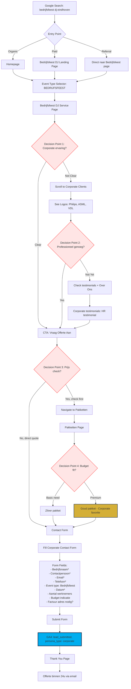

# Corporate Planner User Journey | Bedrijfsfeest Planner User Journey

**Source**: B03 - UX Flows & User Journeys
**Persona**: Corporate Planner (30-50 jaar, HR Manager, ROI-gericht)
**Conversion Goal**: lead_submitted event (persona_type: corporate)

## Flow Diagram

## Decision Points

1. **Corporate ervaring?** - B2B client logos, case studies
2. **Professioneel genoeg?** - Certifications, insurance, HR testimonials
3. **Prijs check?** - Transparent pricing vs. custom quote
4. **Budget fit?** - Package selection (Goud most popular for corporate)

## Success Metrics

| Metric | Target |
|--------|--------|
| Overall Conversion Rate | >12% |
| Goud Package Selection | >60% |
| Avg. Time to Conversion | <10 min |
| Contact Form Submit Rate | >80% |

## Optimization Opportunities

- Display logos of major corporate clients (Philips, ASML, VDL)
- HR Manager testimonials with photos
- "Offerte binnen 24u" guarantee
- Professional tone and business-focused copy
- Include factuur + payment terms information
