# Private Party User Journey | Privé Feest User Journey

**Source**: B03 - UX Flows & User Journeys
**Persona**: Private Party Host (25-60 jaar, verjaardag/jubileum, budget-conscious)
**Conversion Goal**: lead_submitted event (persona_type: feest)

## Flow Diagram

```mermaid
graph TD
    A[Google Search: dj huren verjaardag] --> B{Entry Point}
    B -->|Organic| C[Homepage]
    B -->|Paid| D[Feest DJ Landing Page]
    B -->|Referral| E[Via vriend/familie]

    C --> F[Event Type Selector: FEEST]
    D --> F
    E --> F

    F --> G[Feest DJ Service Page]

    G --> H{Decision Point 1: Type feest match?}
    H -->|Not sure| I[Scroll to Type Feesten sectie]
    H -->|Match| J[CTA: Bekijk Pakketten]

    I --> K[See: Verjaardag, Jubileum, Themafeest, Garden Party]
    K --> L{Decision Point 2: Flexibel genoeg?}
    L -->|Need info| M[Check FAQ]
    L -->|Yes| J

    M --> N[FAQ: Custom playlist? Buren? Gasten aantal?]
    N --> J

    J --> O[Pakketten Page]

    O --> P{Decision Point 3: Budget concerns?}
    P -->|Budget tight| Q[Brons pakket €750-950]
    P -->|Mid-range| R[Zilver pakket €1200-1500]
    P -->|Go all-in| S[Goud pakket]

    Q --> T{Decision Point 4: Add-ons?}
    R --> T
    S --> T

    T -->|Check add-ons| U[Extra Opties:<br/>- LED Dance Floor +€400<br/>- Photobooth +€350<br/>- CO2 Cannons +€200<br/>- Extra lights +€150]
    T -->|No add-ons| V[Contact Form]

    U --> W{Add to package?}
    W -->|Yes| X[Calculate total price]
    W -->|Not now| V

    X --> V

    V --> Y[Fill Contact Form]
    Y --> Z[Form Fields:<br/>- Naam*<br/>- Email*<br/>- Telefoon*<br/>- Gelegenheid: Verjaardag<br/>- Datum*<br/>- Aantal gasten<br/>- Binnen/buiten<br/>- Pakket: Zilver<br/>- Add-ons interesse<br/>- Bericht]
    Z --> AA[Submit Form]
    AA --> AB[GA4: lead_submitted, persona_type: feest]

    AB --> AC[Thank You Page]
    AC --> AD[Bevestiging + advies email]

    style AB fill:#00AEEF,stroke:#1A2C4B,stroke-width:3px
    style R fill:#D4AF37,stroke:#1A2C4B,stroke-width:2px
    style H fill:#FFE5E5,stroke:#FF6B6B,stroke-width:2px
    style L fill:#FFE5E5,stroke:#FF6B6B,stroke-width:2px
    style P fill:#FFE5E5,stroke:#FF6B6B,stroke-width:2px
    style T fill:#FFE5E5,stroke:#FF6B6B,stroke-width:2px
```

## Decision Points

1. **Type feest match?** - Show relevant occasion types (birthday, anniversary, etc.)
2. **Flexibel genoeg?** - Custom playlists, flexible hours, FAQ
3. **Budget concerns?** - 3 package tiers with clear value proposition
4. **Add-ons?** - Visual add-on selector with photos and prices

## Success Metrics

| Metric | Target |
|--------|--------|
| Overall Conversion Rate | >6% |
| Add-on Selection Rate | >30% |
| Avg. Time to Conversion | <20 min |
| Contact Form Submit Rate | >65% |

## Package Distribution Target

- 40% Brons (budget option)
- 45% Zilver (best value)
- 15% Goud (premium)

## Optimization Opportunities

- Visual add-ons display (photos of LED floor, photobooth, etc.)
- Price calculator tool (package + add-ons)
- "Perfect voor 50-100 gasten" recommendations
- FAQ inline on service page (custom playlist, neighbor concerns)
- Flexible package customization messaging
