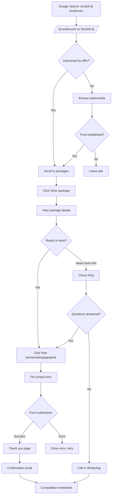
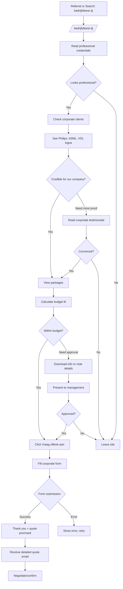
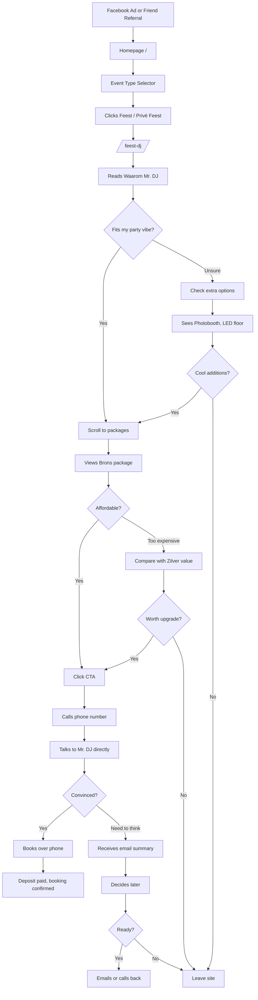

# Mr. DJ - UX Flows & User Journeys

**Created**: 2025-12-03
**Version**: 1.0
**Status**: Production Ready

---

## Overview

This document maps the primary user journeys through the Mr. DJ website, showing how different personas navigate from landing to conversion.

---

## Flow 1: Wedding Couple Journey

**Persona**: Engaged couple planning their wedding
**Entry Point**: Organic search "bruiloft dj eindhoven"
**Goal**: Book a consultation to discuss wedding entertainment

### Flow Diagram (Mermaid)



### Journey Steps

**1. Discovery (Entry)**
- Arrives via Google search or social media
- Lands on city page (/dj-eindhoven/) or service page (/bruiloft-dj/)
- **First 5 seconds**: Sees hero with "DJ + Saxofoon | 100% Dansgarantie"
- **Decision point**: Does this match what I'm looking for?

**2. Exploration (Interest)**
- Scrolls through page to learn more
- Reads "Waarom Mr. DJ voor je bruiloft" section
- Views wedding timeline (ceremony → party)
- Checks testimonials from other couples
- **Decision point**: Do I trust this service?

**3. Evaluation (Consideration)**
- Clicks to /pakketten/ or scrolls to packages section
- Compares Brons / Zilver / Goud
- Sees Zilver highlighted as "Meest Gekozen"
- Notices live saxophone included in Zilver
- **Decision point**: Which package fits our wedding?

**4. Objection Handling**
- Has questions: "Is saxophone suitable for our style?"
- Clicks FAQ link or scrolls to FAQ section
- Reads answers to common wedding questions
- **Decision point**: Are my concerns addressed?

**5. Conversion (Action)**
- Clicks "Plan een kennismakingsgesprek" CTA
- Fills out contact form:
  - Name, email, phone
  - Event type: "Bruiloft" (pre-selected)
  - Wedding date
  - Location
  - Preferred package
  - Additional message
- Submits form
- **Alternative**: Calls directly or sends WhatsApp

**6. Confirmation (Post-conversion)**
- Sees thank you message
- Receives confirmation email within minutes
- Gets follow-up call/email within 24 hours to schedule consultation

### Success Metrics
- **Conversion Rate**: 3-5% of wedding page visitors book consultation
- **Time to Convert**: 3-7 minutes average session
- **Bounce Rate**: <40% on service pages
- **Form Completion**: >70% of started forms submitted

### Friction Points & Solutions
| Friction | Solution |
|----------|----------|
| Uncertainty about saxophone fit | Add audio/video samples, show versatility in FAQ |
| Price concerns | Transparent pricing, show value (15+ years exp, professional equipment) |
| Trust issues (new visitors) | Prominent testimonials, 4.9/5 rating, 500+ events stat |
| Complex booking process | Simple one-page contact form, alternative quick phone/WhatsApp |
| Not ready to commit | Offer "vrijblijvend kennismakingsgesprek" (no-obligation) |

---

## Flow 2: Corporate Event Planner Journey

**Persona**: HR manager or event coordinator planning company event
**Entry Point**: Referral or direct search "bedrijfsfeest dj"
**Goal**: Get a quote and assess professionalism/reliability

### Flow Diagram (Mermaid)



### Journey Steps

**1. Discovery (Validation)**
- Lands on /bedrijfsfeest-dj/ page
- Immediately looks for professionalism signals
- **First 5 seconds**: "Professioneel entertainment voor zakelijke events"
- Scans for credibility markers (years of experience, professional setup)
- **Decision point**: Is this suitable for a corporate environment?

**2. Credential Check (Due Diligence)**
- Looks for proof of corporate experience
- Sees "Ervaring met Philips, ASML, VDL" section
- Reads corporate testimonials
- Checks equipment quality (professional Pioneer gear)
- **Decision point**: Can we trust them with our company reputation?

**3. Service Evaluation**
- Reads "Type Events We Do" section
- Confirms they handle their specific event type
- Checks flexibility (diverse music, professional presentation)
- Reviews what's included in service
- **Decision point**: Do they meet our requirements?

**4. Budget Assessment**
- Navigates to /pakketten/ page
- Compares package prices with budget
- Notes what's included vs extra costs
- Checks for hidden fees (travel costs, overtime)
- **Decision point**: Does this fit our budget?

**5. Internal Approval (Often Required)**
- Takes screenshots or notes details
- May download pricing info (if available)
- Presents to manager or committee
- Gets budget approval
- **Decision point**: Do stakeholders approve?

**6. Request Quote (Conversion)**
- Returns to site (may be days later)
- Clicks "Vraag direct een offerte aan"
- Fills corporate contact form:
  - Company name
  - Contact person
  - Email, phone
  - Event type: "Bedrijfsfeest"
  - Date, location
  - Number of employees
  - Budget indication
  - Special requirements
- Submits request

**7. Negotiation (Post-conversion)**
- Receives detailed quote via email
- Reviews with team
- May negotiate on price or services
- Confirms booking with deposit payment

### Success Metrics
- **Conversion Rate**: 2-4% of corporate page visitors request quote
- **Quote-to-Booking**: 40-50% of quotes convert to bookings
- **Average Deal Size**: €1,500-€2,200 (higher than wedding average)
- **Sales Cycle**: 2-4 weeks from first contact to booking

### Friction Points & Solutions
| Friction | Solution |
|----------|----------|
| Need for approval slows process | Provide downloadable quote/brochure for internal sharing |
| Uncertainty about professionalism | Prominent corporate logos, testimonials from known companies |
| Budget concerns | Clear pricing tiers, transparent about what's included |
| Multiple stakeholders | Offer video call option for group consultation |
| Long sales cycle | Email nurture sequence with case studies and value reminders |

---

## Flow 3: Private Party Host Journey

**Persona**: Individual planning birthday, anniversary, or theme party
**Entry Point**: Facebook ad or word-of-mouth recommendation
**Goal**: Find affordable, fun entertainment for their party

### Flow Diagram (Mermaid)



### Journey Steps

**1. Discovery (Awareness)**
- Sees Facebook ad with energetic party vibe
- OR Friend mentions "Mr. DJ was great at my party!"
- Clicks link, lands on homepage
- **First impression**: Is this the right vibe for my party?

**2. Exploration (Interest)**
- Uses Event Type Selector on homepage
- Selects "Feest" option
- Lands on /feest-dj/ page
- Reads about party types (birthday, anniversary, theme)
- **Decision point**: Do they do parties like mine?

**3. Vibe Check**
- Looks at photos/design to assess style
- Reads "Wat maakt Mr. DJ uniek voor jouw feest?"
- Checks if music style matches party guests
- **Decision point**: Will this be fun for my crowd?

**4. Feature Exploration**
- Scrolls to "Extra Opties" section
- Gets excited about LED floor, photobooth
- Imagines party with these features
- **Decision point**: What extras do I want?

**5. Price Check (Reality Check)**
- Views packages section
- Sees Brons starting at €750-€950
- Compares with budget
- Sees Zilver for €1,200-€1,500 includes saxophon
- **Decision point**: Can I afford this? Is it worth it?

**6. Decision & Action**
- If price works: Clicks CTA immediately
- If uncertain: Calls to discuss and negotiate
- Prefers phone over form (more personal for private events)
- **Alternative**: Sends WhatsApp message

**7. Conversation & Booking (Phone-preferred)**
- Talks directly with Mr. DJ or team
- Discusses party details, music preferences
- Gets personalized recommendations
- Negotiates if needed (e.g., shorter duration for lower price)
- Receives email summary of discussion
- Pays deposit to confirm booking

### Success Metrics
- **Conversion Rate**: 4-6% of party page visitors convert (higher than others due to lower barriers)
- **Phone vs Form**: 60% prefer calling, 40% use form
- **Average Deal Size**: €900-€1,400
- **Booking Lead Time**: Usually 4-8 weeks before event

### Friction Points & Solutions
| Friction | Solution |
|----------|----------|
| Price vs budget concerns | Highlight Brons as affordable option, show value of upgrades |
| Uncertainty about music fit | Offer to discuss music preferences in consultation, show flexibility |
| Comparison shopping | Quick decision incentive: "Book binnen 7 dagen, 5% korting" |
| DIY alternative temptation | Emphasize stress-free experience, professional quality, risk of technical issues with DIY |
| Guest count confusion | Clear guidance: "Brons works for up to 50 guests, Zilver for 50-100" |

---

## Common Cross-Journey Elements

### Universal Decision Points
1. **Trust Check**: "Is this legitimate and professional?"
2. **Value Assessment**: "Is this worth the price?"
3. **Fit Evaluation**: "Does this match my specific needs?"
4. **Comparison**: "How does this compare to alternatives?"
5. **Commitment**: "Am I ready to book now or need more time?"

### Conversion Accelerators (All Journeys)
- ✅ Clear value proposition in first 5 seconds
- ✅ Social proof (testimonials, ratings, client logos)
- ✅ Transparent pricing (no hidden fees)
- ✅ Multiple contact options (form, phone, WhatsApp)
- ✅ Low-friction first step ("vrijblijvend kennismakingsgesprek")
- ✅ Fast response time promise ("binnen 24 uur")
- ✅ Trust signals (15+ years, 500+ events, 4.9/5 rating)

### Friction Removers (All Journeys)
- ❌ Eliminate confusing navigation
- ❌ Remove long forms (keep to essentials)
- ❌ Avoid technical jargon
- ❌ Don't hide pricing
- ❌ No auto-play music/videos
- ❌ Don't make phone number hard to find

---

## Mobile-Specific Journey Considerations

### Mobile Behavior Differences
- **Shorter attention span**: 3 seconds to capture interest
- **Thumb-friendly taps**: CTAs must be large and bottom-positioned
- **Call preference**: 70% of mobile users prefer calling over forms
- **Quick actions**: Sticky phone/WhatsApp buttons crucial

### Mobile Flow Optimizations
1. **Hero Section**: Immediate value prop + CTA within viewport
2. **Sticky Bottom Bar**: Phone & WhatsApp buttons always visible
3. **Accordion FAQs**: Expandable sections save scrolling
4. **One-column layout**: No side-by-side comparisons
5. **Click-to-call**: Phone numbers are tappable links
6. **WhatsApp Web**: Opens WhatsApp app directly

---

## Analytics & Tracking Requirements

### Key Events to Track

**Page Views**:
- Homepage
- Each service page (Bruiloft, Bedrijfsfeest, Feest)
- Pricing page
- Contact page

**Interactions**:
- Event Type Selector usage
- Package card clicks
- CTA button clicks (by type)
- FAQ expansions
- Testimonial carousel interactions

**Conversions**:
- Form submissions (by page)
- Phone button clicks
- WhatsApp button clicks
- Email link clicks

**Funnel Stages**:
1. Landing
2. Service page view
3. Pricing view
4. Contact interaction
5. Form start
6. Form submit
7. Thank you page

### Funnel Analysis
```
Stage 1: Homepage visits = 1,000
Stage 2: Service page = 400 (40% continue)
Stage 3: Pricing view = 200 (50% of service viewers)
Stage 4: Contact interaction = 80 (40% of pricing viewers)
Stage 5: Form start = 60 (75% of contact interactions)
Stage 6: Form submit = 45 (75% completion rate)
Stage 7: Thank you = 45 (100% - if no technical errors)
```

**Overall Conversion Rate**: 4.5% (45 conversions / 1,000 visitors)

---

## Journey Optimization Opportunities

### Quick Wins (High Impact, Low Effort)
1. **Add video testimonials** on service pages
2. **Sticky CTA bar** on mobile (phone + WhatsApp)
3. **Exit-intent popup** with special offer or consultation booking
4. **FAQ search** to quickly find answers
5. **Live chat widget** for instant questions

### Medium-term Improvements
1. **Virtual venue tour** showing Mr. DJ in action
2. **Music sample playlist** demonstrating versatility
3. **Package calculator** (input: guests, hours → recommended package)
4. **Comparison tool** (Mr. DJ vs alternatives table)
5. **Client portal** for booked customers to manage details

### Long-term Enhancements
1. **Full online booking system** with calendar availability
2. **Virtual consultation** via video call scheduling
3. **Personalized landing pages** based on ad source
4. **Retargeting campaigns** for drop-offs
5. **CRM integration** for lead nurturing

---

## Success Criteria (Per Flow)

### Wedding Couple Flow
- [ ] 90% of couples can find bruiloft page within 2 clicks
- [ ] 70% of service page visitors scroll to packages
- [ ] 40% of visitors engage with testimonials
- [ ] 5% conversion rate to consultation booking
- [ ] <3 minutes average time to conversion decision

### Corporate Planner Flow
- [ ] 95% of corporate visitors find credential section immediately
- [ ] 60% of visitors check pricing within session
- [ ] 50% spend >3 minutes on site (due diligence)
- [ ] 3% conversion rate to quote request
- [ ] 45% quote-to-booking conversion

### Private Party Flow
- [ ] 80% of visitors use Event Type Selector
- [ ] 70% view pricing within session
- [ ] 60% prefer calling over form
- [ ] 6% conversion rate (phone + form combined)
- [ ] <48 hours from first visit to booking

---

## Next Steps (Integration with Other Batches)

This UX flow document informs:
- **B04 (UI Design)**: Design components that support these flows
- **B05 (Copywriting)**: Write copy that guides users through journeys
- **B07 (Mobile)**: Optimize for mobile-specific behaviors noted
- **B08 (Conversion)**: Implement optimizations identified
- **B11 (Analytics)**: Set up tracking for events and funnels defined

---

**Document Owner**: UX/Product Team
**Review Cycle**: After major changes or quarterly
**Last Updated**: 2025-12-03
