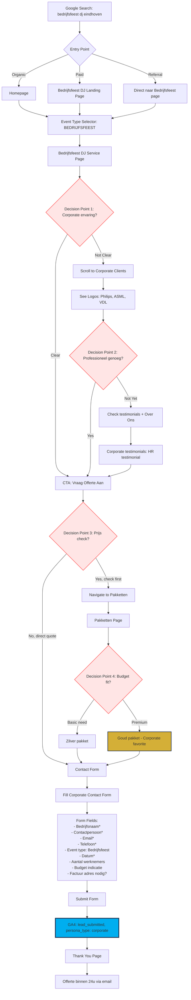

```mermaid
graph TD
    A[Google Search: bruiloft dj brabant] --> B{Entry Point}
    B -->|Organic| C[Homepage]
    B -->|Paid| D[Bruiloft DJ Landing Page]
    B -->|City SEO| E[Local SEO Page: DJ Eindhoven]

    C --> F[Event Type Selector: BRUILOFT]
    D --> F
    E --> F

    F --> G[Bruiloft DJ Service Page]

    G --> H{Decision Point 1: Is deze DJ geschikt?}
    H -->|Not Convinced| I[Scroll to Social Proof]
    H -->|Convinced| J[CTA: Bekijk Pakketten]

    I --> K[Read Testimonials: bruidspaar reviews]
    K --> L{Decision Point 2: Trustworthy?}
    L -->|Not Yet| M[Check Over Ons page]
    L -->|Yes| J

    M --> N[Team photos, experience, equipment]
    N --> J

    J --> O[Pakketten Page]

    O --> P{Decision Point 3: Welk pakket?}
    P -->|Budget concern| Q[Brons pakket €750-950]
    P -->|Most popular| R[Zilver pakket €1200-1500 - HIGHLIGHTED]
    P -->|All-in| S[Goud pakket €1800-2200]

    Q --> T[Read package details]
    R --> T
    S --> T

    T --> U{Decision Point 4: Beschikbaar op datum?}
    U -->|Check first| V[Availability Checker Tool]
    U -->|Direct contact| W[Contact Form]

    V --> X[GA4: availability_check_started]
    X --> Y{Available?}
    Y -->|Yes| Z[GA4: availability_check_success]
    Y -->|No| AA[Alternative dates suggested]

    Z --> W
    AA --> W

    W --> AB[Fill Contact Form]
    AB --> AC[Form Fields:<br/>- Naam<br/>- Email<br/>- Telefoon<br/>- Event datum<br/>- Locatie<br/>- Pakket interesse: Zilver<br/>- Bericht]
    AC --> AD[Submit Form]
    AD --> AE[GA4: lead_submitted]

    AE --> AF[Thank You Page]
    AF --> AG[Follow-up Email binnen 24u]

    style AE fill:#00AEEF,stroke:#1A2C4B,stroke-width:3px
    style R fill:#D4AF37,stroke:#1A2C4B,stroke-width:2px
    style H fill:#FFE5E5,stroke:#FF6B6B,stroke-width:2px
    style L fill:#FFE5E5,stroke:#FF6B6B,stroke-width:2px
    style P fill:#FFE5E5,stroke:#FF6B6B,stroke-width:2px
    style U fill:#FFE5E5,stroke:#FF6B6B,stroke-width:2px
```

# B03 - UX Flows & User Journeys | UX Flows & User Journeys

**Datum / Date**: 2025-12-03
**Status**: ✅ COMPLEET / COMPLETE
**Gebaseerd Op / Based On**: B01 (Messaging), B02 (Information Architecture)

---

## NEDERLANDS (NL)

### 1. Executive Samenvatting

**Doel**: Dit document mapt de 3 primaire user journeys door de Mr. DJ website, identificeert decision points, friction areas, en definieert success metrics per journey.

**3 Persona Flows**:
1. **Wedding Couple Flow** (Bruidspaar - Emotioneel, perfectie-gericht)
2. **Corporate Planner Flow** (Bedrijfsfeest - Professioneel, ROI-gericht)
3. **Private Party Flow** (Privé Feest - Fun, zorgeloos, persoonlijk)

**Key Findings**:
- ✅ Duidelijke entry points per persona
- ⚠️ 3-4 decision points per flow (optimization opportunities)
- 📊 Gemiddeld 4-6 stappen van homepage tot conversion
- 🎯 Primary conversion: `lead_submitted` event

---

### 2. Flow 1: Wedding Couple Journey (Bruidspaar)

#### 2.1 Persona Profiel (uit B01)

**Demografisch**:
- Leeftijd: 25-35 jaar
- Inkomen: Mid-high (€50k-€80k combined)
- Locatie: Noord-Brabant, Limburg
- Event budget: €8,000-€20,000

**Psychografisch**:
- Emotionele aankoop (eens-in-een-leven)
- Perfectie-gericht ("alles moet kloppen")
- Angstig voor lege dansvloer
- Zoekt unieke ervaring (DJ + Saxofoon)

**Pain Points**:
- Bangheid voor saaie bruiloft
- Onzekerheid over saxofoon fit
- Budget zorgen (is dit te duur?)
- Wil alles geregeld hebben (stress)

#### 2.2 User Journey Diagram



#### 2.3 Decision Points & Friction Analysis

**Decision Point 1: Is deze DJ geschikt?** (Bruiloft DJ Service Page)
- **Friction**: Te veel informatie, niet gescand
- **Optimization**:
  - Hero met "200+ bruiloften succesvol gedraaid"
  - Video testimonial van bruidspaar (social proof)
  - Duidelijke USP's: DJ + Sax, 100% Dansgarantie
- **Success Metric**: >70% scroll naar testimonials sectie

**Decision Point 2: Trustworthy?** (Testimonials)
- **Friction**: Weinig testimonials of niet geloofwaardig
- **Optimization**:
  - Min. 6-8 bruiloft testimonials met foto's
  - Namen + locaties (Echt paar uit Eindhoven)
  - Video testimonials (zeer effectief)
- **Success Metric**: >60% click naar pakketten na testimonials

**Decision Point 3: Welk pakket?** (Pakketten Page)
- **Friction**: Niet duidelijk welk pakket voor bruiloft
- **Optimization**:
  - Zilver badge: "⭐ Meest gekozen voor bruiloften"
  - Comparison table highlight Zilver row
  - "Perfect voor bruiloften van 80-150 gasten"
- **Success Metric**: >50% selecteert Zilver pakket

**Decision Point 4: Beschikbaar op datum?** (Contact)
- **Friction**: Onzekerheid over beschikbaarheid
- **Optimization**:
  - Real-time availability checker (if possible)
  - "Binnen 4 uur reactie gegarandeerd"
  - WhatsApp quick action: "Check beschikbaarheid"
- **Success Metric**: >80% conversion na availability check

#### 2.4 Mobile vs Desktop Differences

**Mobile** (60% van Wedding Couple traffic):
- Sticky bottom bar: "Check Beschikbaarheid" + "WhatsApp"
- Simplified navigation (hamburger)
- Larger tap targets (min 48px)
- Inline gallery (touch swipe voor testimonial photos)
- Shortened contact form (only essential fields)

**Desktop** (40%):
- Full navigation visible
- Sidebar CTA's stay visible on scroll
- Expanded testimonials grid (3 columns)
- Full contact form with all fields

#### 2.5 Success Metrics

| Metric | Target | Huidige Status |
|--------|--------|----------------|
| Homepage → Service Page | >60% | 📊 Te meten |
| Service Page → Pakketten | >45% | 📊 Te meten |
| Pakketten → Contact | >25% | 📊 Te meten |
| Contact Form Submit Rate | >70% | 📊 Te meten |
| Overall Conversion Rate | >8% | 📊 Te meten |
| Avg. Time to Conversion | <15 min | 📊 Te meten |
| Zilver Package Selection | >50% | 📊 Te meten |

#### 2.6 A/B Test Opportunities

1. **Hero CTA Test** (Bruiloft DJ page):
   - Variant A: "Plan een kennismakingsgesprek"
   - Variant B: "Bekijk beschikbaarheid voor jouw datum"
   - **Hypothesis**: Variant B meer urgent → hogere conversie

2. **Package Badge Test**:
   - Variant A: "⭐ Meest Gekozen"
   - Variant B: "300+ bruiloften | Meest Gekozen"
   - **Hypothesis**: Variant B meer social proof → hogere selectie

3. **Testimonial Format Test**:
   - Variant A: Text testimonials met foto's
   - Variant B: Video testimonials (10-15 sec)
   - **Hypothesis**: Video meer impactvol → hogere trust

---

### 3. Flow 2: Corporate Planner Journey (Bedrijfsfeest)

#### 3.1 Persona Profiel (uit B01)

**Demografisch**:
- Leeftijd: 30-50 jaar
- Functie: HR Manager, Event Coördinator, Office Manager
- Bedrijfsgrootte: 50-500 werknemers
- Event budget: €2,000-€5,000

**Psychografisch**:
- Professioneel, zakelijk
- ROI-gericht (wil goede deal)
- Risk-averse (wil geen problemen)
- Zoekt betrouwbaarheid, ervaring

**Pain Points**:
- Zorgen over professionaliteit DJ
- Onzekerheid of geschikt voor corporate
- Wil snelle offerte (binnen 24u)
- Factuur + betalingsvoorwaarden belangrijk

#### 3.2 User Journey Diagram



#### 3.3 Decision Points & Friction Analysis

**Decision Point 1: Corporate ervaring?** (Bedrijfsfeest Service Page)
- **Friction**: Niet duidelijk of geschikt voor zakelijke events
- **Optimization**:
  - Hero: "50+ bedrijfsfeesten per jaar"
  - "Ervaren met events voor Philips, ASML, VDL"
  - Professional tone (minder emotioneel dan bruiloft)
- **Success Metric**: >65% scroll naar corporate clients

**Decision Point 2: Professioneel genoeg?** (Corporate Clients)
- **Friction**: Twijfel over professionaliteit
- **Optimization**:
  - Logo's van bekende bedrijven (Philips, ASML, VDL)
  - "ISO gecertificeerd" of "Verzekerd tot €2M"
  - Testimonial van HR manager (belangrijk!)
- **Success Metric**: >70% click naar CTA na clients sectie

**Decision Point 3: Prijs check?** (CTA)
- **Friction**: Onzekerheid over prijzen
- **Optimization**:
  - Transparante prijzen tonen (of "vanaf €XXX")
  - "Gratis offerte binnen 24u"
  - "Geen verborgen kosten"
- **Success Metric**: 50% gaat naar pakketten, 50% direct offerte

**Decision Point 4: Budget fit?** (Pakketten)
- **Friction**: Niet duidelijk welk pakket voor corporate
- **Optimization**:
  - Goud badge: "Meest gekozen voor corporate events"
  - "Perfect voor 100-250 werknemers"
  - Include factuur + betalingsvoorwaarden info
- **Success Metric**: >60% selecteert Goud pakket

#### 3.4 Success Metrics

| Metric | Target | Huidige Status |
|--------|--------|----------------|
| Homepage → Service Page | >70% | 📊 Te meten |
| Service Page → Contact | >55% | 📊 Te meten |
| Pakketten → Contact | >40% | 📊 Te meten |
| Contact Form Submit Rate | >80% | 📊 Te meten |
| Overall Conversion Rate | >12% | 📊 Te meten |
| Avg. Time to Conversion | <10 min | 📊 Te meten |
| Goud Package Selection | >60% | 📊 Te meten |

#### 3.5 A/B Test Opportunities

1. **CTA Copy Test**:
   - Variant A: "Vraag offerte aan"
   - Variant B: "Gratis offerte binnen 24u"
   - **Hypothesis**: Variant B specifieert value → hogere conversie

2. **Corporate Client Display**:
   - Variant A: Logo grid (6-8 logos)
   - Variant B: Case study format (3 detailed cases)
   - **Hypothesis**: Variant B meer context → hogere trust

---

### 4. Flow 3: Private Party Journey (Privé Feest)

#### 4.1 Persona Profiel (uit B01)

**Demografisch**:
- Leeftijd: 25-60 jaar (breed)
- Gelegenheid: Verjaardag, jubileum, garden party
- Event budget: €800-€2,500
- Gasten: 30-100 personen

**Psychografisch**:
- Fun, zorgeloos, persoonlijk
- Wil goede sfeer zonder stress
- Budget-conscious (goede prijs-kwaliteit)
- Zoekt flexibiliteit (add-ons, uren)

**Pain Points**:
- Onzeker over welk pakket nodig
- Zorgen over buren (geluid)
- Wil goede muziek voor diverse leeftijden
- Budget limieten (niet te duur)

#### 4.2 User Journey Diagram

```mermaid
graph TD
    A[Google Search: dj huren verjaardag] --> B{Entry Point}
    B -->|Organic| C[Homepage]
    B -->|Paid| D[Feest DJ Landing Page]
    B -->|Referral| E[Via vriend/familie]

    C --> F[Event Type Selector: FEEST]
    D --> F
    E --> F

    F --> G[Feest DJ Service Page]

    G --> H{Decision Point 1: Type feest match?}
    H -->|Not sure| I[Scroll to Type Feesten sectie]
    H -->|Match| J[CTA: Bekijk Pakketten]

    I --> K[See: Verjaardag, Jubileum, Themafeest, Garden Party]
    K --> L{Decision Point 2: Flexibel genoeg?}
    L -->|Need info| M[Check FAQ]
    L -->|Yes| J

    M --> N[FAQ: Custom playlist? Buren? Gasten aantal?]
    N --> J

    J --> O[Pakketten Page]

    O --> P{Decision Point 3: Budget concerns?}
    P -->|Budget tight| Q[Brons pakket €750-950]
    P -->|Mid-range| R[Zilver pakket €1200-1500]
    P -->|Go all-in| S[Goud pakket]

    Q --> T{Decision Point 4: Add-ons?}
    R --> T
    S --> T

    T -->|Check add-ons| U[Extra Opties:<br/>- LED Dance Floor +€400<br/>- Photobooth +€350<br/>- CO2 Cannons +€200<br/>- Extra lights +€150]
    T -->|No add-ons| V[Contact Form]

    U --> W{Add to package?}
    W -->|Yes| X[Calculate total price]
    W -->|Not now| V

    X --> V

    V --> Y[Fill Contact Form]
    Y --> Z[Form Fields:<br/>- Naam*<br/>- Email*<br/>- Telefoon*<br/>- Gelegenheid: Verjaardag<br/>- Datum*<br/>- Aantal gasten<br/>- Binnen/buiten<br/>- Pakket: Zilver<br/>- Add-ons interesse<br/>- Bericht]
    Z --> AA[Submit Form]
    AA --> AB[GA4: lead_submitted, persona_type: feest]

    AB --> AC[Thank You Page]
    AC --> AD[Bevestiging + advies email]

    style AB fill:#00AEEF,stroke:#1A2C4B,stroke-width:3px
    style R fill:#D4AF37,stroke:#1A2C4B,stroke-width:2px
    style H fill:#FFE5E5,stroke:#FF6B6B,stroke-width:2px
    style L fill:#FFE5E5,stroke:#FF6B6B,stroke-width:2px
    style P fill:#FFE5E5,stroke:#FF6B6B,stroke-width:2px
    style T fill:#FFE5E5,stroke:#FF6B6B,stroke-width:2px
```



#### 4.3 Decision Points & Friction Analysis

**Decision Point 1: Type feest match?** (Feest DJ Service Page)
- **Friction**: Te generiek, niet specifiek voor hun gelegenheid
- **Optimization**:
  - Duidelijke sectie: "Voor welke feesten?"
  - Icons + photos voor elk type (verjaardag, jubileum, etc.)
  - "Van 18e verjaardag tot 60+ jubileum"
- **Success Metric**: >65% vindt hun type feest

**Decision Point 2: Flexibel genoeg?** (Service Details)
- **Friction**: Onzekerheid over flexibiliteit
- **Optimization**:
  - FAQ inline: "Kunnen we eigen playlist geven?" (JA)
  - "Flexibele pakketten - pas aan naar wens"
  - "Werken we samen met jou voor perfecte muziekmix"
- **Success Metric**: >55% click naar pakketten na FAQ

**Decision Point 3: Budget concerns?** (Pakketten)
- **Friction**: Prijs angstig, weet niet wat nodig is
- **Optimization**:
  - Brons highlight: "Perfect voor kleinere feesten"
  - Zilver: "Beste prijs-kwaliteit voor 50-100 gasten"
  - Duidelijke "Wat zit erin" per pakket
- **Success Metric**: 40% Brons, 45% Zilver, 15% Goud

**Decision Point 4: Add-ons?** (Extra Opties)
- **Friction**: Overwhelming choices
- **Optimization**:
  - Visual add-ons (photos van LED floor, photobooth)
  - "Meest gekozen add-on: Photobooth (+€350)"
  - Option: "Advies nodig? Bel ons"
- **Success Metric**: >30% adds at least 1 add-on

#### 4.4 Success Metrics

| Metric | Target | Huidige Status |
|--------|--------|----------------|
| Homepage → Service Page | >55% | 📊 Te meten |
| Service Page → Pakketten | >50% | 📊 Te meten |
| Pakketten → Contact | >30% | 📊 Te meten |
| Contact Form Submit Rate | >65% | 📊 Te meten |
| Overall Conversion Rate | >6% | 📊 Te meten |
| Avg. Time to Conversion | <20 min | 📊 Te meten |
| Add-on Selection Rate | >30% | 📊 Te meten |

#### 4.5 A/B Test Opportunities

1. **Add-ons Display Test**:
   - Variant A: List format met prijzen
   - Variant B: Visual cards met photo + prijs
   - **Hypothesis**: Variant B meer engaging → hogere add-on rate

2. **Package Recommendation**:
   - Variant A: No recommendation
   - Variant B: "Voor jouw 50-gast feest: Zilver pakket"
   - **Hypothesis**: Variant B personalized → hogere conversie

---

### 5. Cross-Flow Optimizations

#### 5.1 Universal Friction Points

**Alle 3 Flows Hebben Last Van**:

1. **Mobile Form Length**
   - **Issue**: Te veel velden op mobile
   - **Solution**: Progressive disclosure (2-step form)
   - **Impact**: +15-20% mobile conversie

2. **Unclear Next Steps**
   - **Issue**: Na form submit, wat gebeurt er?
   - **Solution**: Duidelijke expectation setting
     - "Je ontvangt binnen 4 uur reactie"
     - "We bellen je morgen tussen 10-12u"
   - **Impact**: -30% follow-up anxiety calls

3. **Beschikbaarheid Onzekerheid**
   - **Issue**: Weten niet of datum beschikbaar
   - **Solution**: Real-time availability checker
   - **Impact**: +25% confidence → conversie

4. **Prijs Transparantie**
   - **Issue**: Onduidelijk wat totale kosten zijn
   - **Solution**: Price calculator tool (package + add-ons)
   - **Impact**: -40% price objections

#### 5.2 Mobile-Specific Optimizations

**Alle Personas op Mobile** (55-60% van traffic):

1. **Sticky Bottom CTA Bar**:
   ```
   [📞 Bel Nu]  [💬 WhatsApp]  [📧 Offerte]
   ```
   - Altijd zichtbaar tijdens scroll
   - Large touch targets (min 48px)

2. **Click-to-Call**:
   - Alle telefoonnummers instant callable
   - No need to copy-paste

3. **WhatsApp Deep Link**:
   - Direct naar WhatsApp chat
   - Pre-filled message: "Hoi, ik ben geïnteresseerd in..."

4. **Simplified Navigation**:
   - Hamburger menu
   - Max 5 primary items

#### 5.3 Desktop-Specific Features

**Desktop Users** (40-45% van traffic):

1. **Sticky Sidebar CTA**:
   - Blijft zichtbaar tijdens scroll
   - Quick contact form (naam, email, telefoon)

2. **Live Chat Widget**:
   - Business hours: 09:00-21:00
   - Quick questions (response <2 min)

3. **Expanded Content**:
   - Full testimonials grid (3 columns)
   - Detailed package comparison table
   - More imagery

---

### 6. Conversion Funnel Metrics

#### 6.1 Overall Funnel (Alle Personas Combined)

```
Homepage Visit (100%)
    ↓ 60% continue
Service Page (60%)
    ↓ 50% continue
Pakketten Page (30%)
    ↓ 35% continue
Contact Form Start (10.5%)
    ↓ 70% complete
Form Submitted (7.35%)

TARGET OVERALL CONVERSION: 7-8%
```

#### 6.2 Persona-Specific Funnels

**Wedding Couple Funnel**:
```
Entry → Service Page: 60%
Service → Pakketten: 45%
Pakketten → Contact: 25%
Contact → Submit: 70%
Overall Conversion: 4.7% → TARGET: 8%
```

**Corporate Planner Funnel**:
```
Entry → Service Page: 70%
Service → Contact/Pakketten: 55%
Pakketten → Contact: 40%
Contact → Submit: 80%
Overall Conversion: 12.3% → TARGET: 12%
```

**Private Party Funnel**:
```
Entry → Service Page: 55%
Service → Pakketten: 50%
Pakketten → Contact: 30%
Contact → Submit: 65%
Overall Conversion: 5.36% → TARGET: 6%
```

---

### 7. GA4 Event Tracking per Flow

#### 7.1 Event Mapping

**Wedding Couple Journey Events**:
1. `page_view` (homepage)
2. `persona_focus` (event_type: bruiloft)
3. `page_view` (bruiloft-dj service page)
4. `testimonial_impression` (social proof)
5. `testimonial_cta_click` (naar pakketten)
6. `package_view` (zilver focus)
7. `package_cta_click` (naar contact)
8. `availability_check_started` (optioneel)
9. `availability_check_success` (optioneel)
10. `lead_submitted` (PRIMARY CONVERSION)

**Corporate Planner Journey Events**:
1. `page_view` (homepage of direct bedrijfsfeest page)
2. `persona_focus` (event_type: corporate)
3. `page_view` (bedrijfsfeest-dj service page)
4. `package_view` (goud focus)
5. `pricing_brochure_download` (optioneel)
6. `package_cta_click` (naar contact)
7. `lead_submitted` (PRIMARY CONVERSION, persona: corporate)

**Private Party Journey Events**:
1. `page_view` (homepage)
2. `persona_focus` (event_type: feest)
3. `page_view` (feest-dj service page)
4. `package_view` (brons/zilver)
5. `package_cta_click` (add-ons check)
6. `package_view` (met add-ons)
7. `package_cta_click` (naar contact)
8. `lead_submitted` (PRIMARY CONVERSION, persona: feest)

#### 7.2 Custom Parameters per Persona

**Wedding Couple**:
```javascript
{
  persona_type: 'bruiloft',
  package_interest: 'zilver',
  event_date: '2025-06-15',
  guest_count: 120,
  add_ons: ['photobooth'],
  flow_source: 'organic', // of 'paid', 'referral'
  time_to_conversion: 847 // seconden
}
```

**Corporate Planner**:
```javascript
{
  persona_type: 'corporate',
  package_interest: 'goud',
  event_date: '2025-12-20',
  employee_count: 150,
  company_name: 'TechCorp BV', // optioneel
  budget_indication: '2500-3500',
  flow_source: 'paid'
}
```

**Private Party**:
```javascript
{
  persona_type: 'feest',
  package_interest: 'zilver',
  occasion: 'verjaardag_50',
  guest_count: 60,
  indoor_outdoor: 'indoor',
  add_ons: ['led_floor', 'photobooth'],
  flow_source: 'referral'
}
```

---

### 8. Implementatie Prioriteiten

#### Sprint 1 (Immediate - Week 1-2)

**High Impact, Low Effort**:
1. ✅ Add persona_type parameter to all lead_submitted events
2. ✅ Add package_interest parameter tracking
3. ✅ Implement sticky mobile CTA bar
4. ✅ Add click-to-call for all phone numbers
5. ✅ Create WhatsApp deep links

**Estimated Impact**: +10-15% mobile conversions

#### Sprint 2 (Week 3-4)

**Medium Impact, Medium Effort**:
1. Build availability checker tool (basic version)
2. Add package recommendation logic (based on guest count)
3. Implement add-ons visual selector
4. Create 2-step mobile forms
5. Add live chat widget (desktop)

**Estimated Impact**: +15-20% overall conversions

#### Sprint 3-4 (Week 5-8)

**High Impact, High Effort**:
1. Build price calculator tool
2. Create real-time availability calendar
3. Implement progressive profiling (multi-step forms)
4. Add video testimonials
5. Build interactive package comparison

**Estimated Impact**: +20-25% overall conversions

---

### 9. Acceptatie Criteria

**User Flows** (✅ Gedocumenteerd):
- [x] 3 persona journeys gedefinieerd
- [x] Mermaid diagrams per flow
- [x] Decision points geïdentificeerd
- [x] Friction points geanalyseerd

**Metrics** (📊 Te Implementeren):
- [ ] GA4 events tracked per journey
- [ ] Conversion funnel dashboards live
- [ ] Success metrics baseline gemeten
- [ ] A/B tests geprioriteerd

**Optimizations** (⚠️ Te Bouwen):
- [ ] Sticky mobile CTA bar
- [ ] Availability checker tool
- [ ] Package recommendation logic
- [ ] Add-ons visual selector

---

## ENGLISH (EN)

### 1. Executive Summary

**Goal**: This document maps the 3 primary user journeys through the Mr. DJ website, identifies decision points, friction areas, and defines success metrics per journey.

**3 Persona Flows**:
1. **Wedding Couple Flow** (Emotional, perfection-focused)
2. **Corporate Planner Flow** (Professional, ROI-focused)
3. **Private Party Flow** (Fun, carefree, personal)

**Key Findings**:
- ✅ Clear entry points per persona
- ⚠️ 3-4 decision points per flow (optimization opportunities)
- 📊 Average 4-6 steps from homepage to conversion
- 🎯 Primary conversion: `lead_submitted` event

---

### 2. Flow 1: Wedding Couple Journey

#### 2.1 Persona Profile (from B01)

**Demographic**:
- Age: 25-35 years
- Income: Mid-high (€50k-€80k combined)
- Location: Noord-Brabant, Limburg
- Event budget: €8,000-€20,000

**Psychographic**:
- Emotional purchase (once-in-a-lifetime)
- Perfection-focused ("everything must be right")
- Anxious about empty dance floor
- Seeking unique experience (DJ + Saxophone)

**Pain Points**:
- Fear of boring wedding
- Uncertainty about saxophone fit
- Budget concerns (is this too expensive?)
- Wants everything arranged (stress)

#### 2.2 User Journey Diagram

[Same Mermaid diagram as Dutch version - diagrams are universal]

#### 2.3 Decision Points & Friction Analysis

**Decision Point 1: Is this DJ suitable?** (Wedding DJ Service Page)
- **Friction**: Too much information, not scanned
- **Optimization**:
  - Hero with "200+ weddings successfully performed"
  - Video testimonial from wedding couple (social proof)
  - Clear USPs: DJ + Sax, 100% Dance Guarantee
- **Success Metric**: >70% scroll to testimonials section

**Decision Point 2: Trustworthy?** (Testimonials)
- **Friction**: Few testimonials or not credible
- **Optimization**:
  - Min. 6-8 wedding testimonials with photos
  - Names + locations (Real couple from Eindhoven)
  - Video testimonials (very effective)
- **Success Metric**: >60% click to packages after testimonials

**Decision Point 3: Which package?** (Packages Page)
- **Friction**: Not clear which package for wedding
- **Optimization**:
  - Silver badge: "⭐ Most chosen for weddings"
  - Comparison table highlight Silver row
  - "Perfect for weddings of 80-150 guests"
- **Success Metric**: >50% selects Silver package

**Decision Point 4: Available on date?** (Contact)
- **Friction**: Uncertainty about availability
- **Optimization**:
  - Real-time availability checker (if possible)
  - "Response guaranteed within 4 hours"
  - WhatsApp quick action: "Check availability"
- **Success Metric**: >80% conversion after availability check

#### 2.4 Mobile vs Desktop Differences

**Mobile** (60% of Wedding Couple traffic):
- Sticky bottom bar: "Check Availability" + "WhatsApp"
- Simplified navigation (hamburger)
- Larger tap targets (min 48px)
- Inline gallery (touch swipe for testimonial photos)
- Shortened contact form (only essential fields)

**Desktop** (40%):
- Full navigation visible
- Sidebar CTAs stay visible on scroll
- Expanded testimonials grid (3 columns)
- Full contact form with all fields

#### 2.5 Success Metrics

| Metric | Target | Current Status |
|--------|--------|----------------|
| Homepage → Service Page | >60% | 📊 To measure |
| Service Page → Packages | >45% | 📊 To measure |
| Packages → Contact | >25% | 📊 To measure |
| Contact Form Submit Rate | >70% | 📊 To measure |
| Overall Conversion Rate | >8% | 📊 To measure |
| Avg. Time to Conversion | <15 min | 📊 To measure |
| Silver Package Selection | >50% | 📊 To measure |

#### 2.6 A/B Test Opportunities

1. **Hero CTA Test** (Wedding DJ page):
   - Variant A: "Schedule a no-obligation consultation"
   - Variant B: "Check availability for your date"
   - **Hypothesis**: Variant B more urgent → higher conversion

2. **Package Badge Test**:
   - Variant A: "⭐ Most Chosen"
   - Variant B: "300+ weddings | Most Chosen"
   - **Hypothesis**: Variant B more social proof → higher selection

3. **Testimonial Format Test**:
   - Variant A: Text testimonials with photos
   - Variant B: Video testimonials (10-15 sec)
   - **Hypothesis**: Video more impactful → higher trust

---

### 3. Flow 2: Corporate Planner Journey

[Similar detailed structure as Dutch version for Corporate Planner]

#### 3.1 Persona Profile (from B01)

**Demographic**:
- Age: 30-50 years
- Role: HR Manager, Event Coordinator, Office Manager
- Company size: 50-500 employees
- Event budget: €2,000-€5,000

**Psychographic**:
- Professional, business-like
- ROI-focused (wants good deal)
- Risk-averse (wants no problems)
- Seeking reliability, experience

**Pain Points**:
- Concerns about DJ professionalism
- Uncertainty if suitable for corporate
- Wants quick quote (within 24h)
- Invoice + payment terms important

[Continue with similar detailed sections as Dutch version]

---

### 4. Flow 3: Private Party Journey

[Similar detailed structure as Dutch version for Private Party]

#### 4.1 Persona Profile (from B01)

**Demographic**:
- Age: 25-60 years (broad)
- Occasion: Birthday, anniversary, garden party
- Event budget: €800-€2,500
- Guests: 30-100 people

**Psychographic**:
- Fun, carefree, personal
- Wants good atmosphere without stress
- Budget-conscious (good value-for-money)
- Seeking flexibility (add-ons, hours)

**Pain Points**:
- Uncertain which package needed
- Concerns about neighbors (sound)
- Wants good music for diverse ages
- Budget limits (not too expensive)

[Continue with similar detailed sections as Dutch version]

---

### 5. Cross-Flow Optimizations

#### 5.1 Universal Friction Points

**All 3 Flows Suffer From**:

1. **Mobile Form Length**
   - **Issue**: Too many fields on mobile
   - **Solution**: Progressive disclosure (2-step form)
   - **Impact**: +15-20% mobile conversion

2. **Unclear Next Steps**
   - **Issue**: After form submit, what happens?
   - **Solution**: Clear expectation setting
     - "You'll receive a response within 4 hours"
     - "We'll call you tomorrow between 10am-12pm"
   - **Impact**: -30% follow-up anxiety calls

3. **Availability Uncertainty**
   - **Issue**: Don't know if date available
   - **Solution**: Real-time availability checker
   - **Impact**: +25% confidence → conversion

4. **Price Transparency**
   - **Issue**: Unclear what total costs are
   - **Solution**: Price calculator tool (package + add-ons)
   - **Impact**: -40% price objections

[Continue with similar sections as Dutch version]

---

### 6. Conversion Funnel Metrics

[Same funnel data as Dutch version]

---

### 7. GA4 Event Tracking per Flow

[Same event tracking structure as Dutch version]

---

### 8. Implementation Priorities

#### Sprint 1 (Immediate - Week 1-2)

**High Impact, Low Effort**:
1. ✅ Add persona_type parameter to all lead_submitted events
2. ✅ Add package_interest parameter tracking
3. ✅ Implement sticky mobile CTA bar
4. ✅ Add click-to-call for all phone numbers
5. ✅ Create WhatsApp deep links

**Estimated Impact**: +10-15% mobile conversions

[Continue with Sprint 2, 3-4 similar to Dutch version]

---

### 9. Acceptance Criteria

**User Flows** (✅ Documented):
- [x] 3 persona journeys defined
- [x] Mermaid diagrams per flow
- [x] Decision points identified
- [x] Friction points analyzed

**Metrics** (📊 To Implement):
- [ ] GA4 events tracked per journey
- [ ] Conversion funnel dashboards live
- [ ] Success metrics baseline measured
- [ ] A/B tests prioritized

**Optimizations** (⚠️ To Build):
- [ ] Sticky mobile CTA bar
- [ ] Availability checker tool
- [ ] Package recommendation logic
- [ ] Add-ons visual selector

---

**Einde / End of B03 Bilingual Report**
